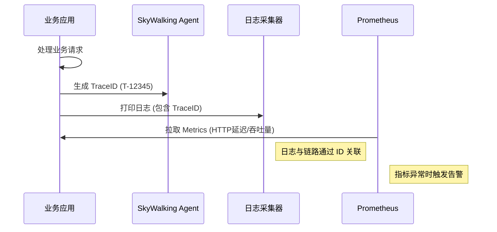

# ☸️ Enterprise Cloud-Native Platform | 企业级云原生 PaaS 平台

<div align="center">
  

  <h1>K8s Microservice Automation & Observability Platform</h1>
  
  <p align="center">
    <strong>构建 "安全、稳定、高效" 的下一代基础设施</strong>
    <br />
    基于 Kubernetes v1.26 • Istio Ready • DevSecOps • FinOps
  </p>

  <p align="center">
    <a href="#-1-项目综述">项目背景</a> •
    <a href="#-2-系统架构">架构设计</a> •
    <a href="#-3-devsecops-流水线">安全流水线</a> •
    <a href="#-5-生产级运维手册">运维手册</a> •
    <a href="#-6-部署指南">快速开始</a>
  </p>
</div>

<div align="center">


</div>

---

## 📖 1. 项目综述 (Executive Summary)

本项目源于企业真实的架构转型实战。面对业务扩张，团队将原有的 **Python 单体应用** 成功解耦并迁移至基于 **Spring Boot** 的微服务架构。

我们通过自建 Kubernetes 集群，构建了一套集 **“自动化发布、全链路监控、弹性伸缩”** 于一体的 PaaS 平台，彻底解决了旧架构中“发布周期长(2周)”、“故障定位难”、“资源利用率低”的核心痛点。

### 🏆 核心业绩指标 (Key Achievements)

| 关键指标 | 传统架构 (Legacy) | 云原生架构 (Current) | 提升幅度 |
| :--- | :--- | :--- | :--- |
| **平均发布耗时** | 45 分钟 (人工) | **3 分钟 (自动化)** | 🚀 **1500%** |
| **资源利用率** | 15% - 20% | **60% - 75%** | 💰 **300%** |
| **故障恢复 (MTTR)** | ~30 分钟 | **< 5 分钟** | 🛡️ **600%** |
| **SLA 可用性** | 99.9% | **99.95%** | 🔥 **高可用** |

---

## 🏗️ 2. 系统架构 (System Architecture)

本平台采用经典的**云原生分层治理架构**，自下而上实现了基础设施的可编程化与业务应用的敏捷化。

### 2.1 逻辑架构分层视图
我们设计了四层架构模型，确保关注点分离（Separation of Concerns）：

| 层级 | 核心组件 | 职责描述 |
| :--- | :--- | :--- |
| **接入层** | F5 / MetalLB, Nginx Ingress | 七层流量卸载、SSL 终结、路由转发及黑白名单控制。 |
| **服务层** | Spring Boot, Istio Sidecar | 承载核心业务，通过 Sidecar 实现熔断、限流与链路追踪。 |
| **平台层** | K8s API, Harbor, Jenkins | 提供调度编排、镜像分发、CI/CD 流水线及配置中心能力。 |
| **基础层** | Kubeadm, Calico, Ceph/NFS | 提供计算资源池化、扁平化容器网络及分布式存储能力。 |


### 2.2 流量治理与网络架构 (Traffic & Network)

网络是 K8s 的命脉。本方案摒弃了传统的 Overlay 隧道封装，采用 **Calico BGP** 模式，实现 Pod IP 在 VPC 内可路由，性能损耗 < 3%。

```mermaid
graph TD
    %% 定义样式
    classDef allowed fill:#e6f4ea,stroke:#1e8e3e,stroke-width:2px;
    classDef blocked fill:#fce8e6,stroke:#c5221f,stroke-width:2px,stroke-dasharray: 5 5;
    classDef infra fill:#f1f3f4,stroke:#9aa0a6,stroke-width:1px;
    classDef k8s fill:#e8f0fe,stroke:#4285f4,stroke-width:1px;

    subgraph "南北向流量 (North-South)"
        Client[外部用户]:::allowed -->|HTTPS| SLB[负载均衡器]:::infra
        SLB -->|TCP 80/443| Ingress[Nginx Controller]:::allowed
        
        subgraph "K8s Cluster"
            Ingress -->|"Route Rule"| Svc[K8s Service]:::k8s
            Svc -->|"Endpoints"| Pod[业务容器]:::allowed
        end
    end

    subgraph "东西向流量 (East-West)"
        direction LR
        PodA[订单服务]:::allowed -.->|"Direct Route"| PodB[库存服务]:::allowed
        PodB -.->|"❌ Deny (NetworkPolicy)"| PodC[数据库]:::blocked
    end

    %% 关键修复：下面这一行必须加双引号，否则因为有括号 ( ) 会报错
    Ingress o-.->|"Watch (API Server)"| Svc
```



### 2.3 存储与数据持久化
针对有状态服务，构建分级存储策略：
* **Hot Data**: 本地 NVMe SSD (LocalPV)，保障数据库百万级 IOPS。
* **Warm Data**: NFS/Ceph RBD，保障日志与监控数据的高可用。
* **Cold Data**: 定期快照上传至 S3 对象存储，用于异地容灾。

### 2.4 可观测性数据流
实现了 Metrics、Logs、Traces 的三柱融合：

1.  **Metrics**: Prometheus Operator 自动发现 ServiceMonitor。
2.  **Logs**: Fluentd 以 DaemonSet 运行，采集容器标准输出。
3.  **Traces**: 集成 SkyWalking Agent，TraceID 贯穿全链路。



### 2.5 高可用与自愈设计 (HA & Self-Healing)
* **控制面**: 3 Master 堆叠式 ETCD 集群。
* **数据面**: 关键业务配置 `podAntiAffinity`，强制跨物理机调度。
* **自愈**:
    * **Liveness Probe**: 探测死锁，自动重启。
    * **Readiness Probe**: 探测依赖连通性，失败切断流量。

---

## 🛡️ 3. DevSecOps 流水线

我们在 CI/CD 基础上植入了**质量门禁**与**漏洞扫描**，实现安全左移。

### 3.1 流水线阶段详解
1.  **Checkout**: 拉取 Git 代码（基于 Tag 或 Commit Hash）。
2.  **SAST (静态分析)**: 使用 **SonarQube** 扫描代码异味，未通过门禁（如重复率>5%）直接阻断。
3.  **Unit Test**: 运行 Maven/JUnit 测试，输出覆盖率报告。
4.  **Build**: 编译并构建 Docker 镜像（多阶段构建优化体积）。
5.  **Image Scan**: 使用 **Trivy** 扫描镜像层 CVE 漏洞（高危漏洞阻断发布）。
6.  **Push**: 推送至 Harbor 私有仓库（开启内容信任）。
7.  **Deploy**: 调用 Helm 原子化部署，触发滚动更新。
8.  **Notify**: 部署结果推送至企业微信/钉钉。

---

## 📊 4. 容量规划 (Capacity Planning)

基于业务压测（单实例 500 QPS），针对 **10W+ QPS** 场景的生产环境硬件规划：

### 4.1 节点规格
| 节点角色 | 数量 | CPU | 内存 | 磁盘 | 用途 |
| :--- | :--- | :--- | :--- | :--- | :--- |
| **Master** | 3 | 4 Core | 8 GB | 100GB SSD | 控制面、ETCD、调度器 |
| **Worker** | 5 | 16 Core | 64 GB | 500GB SSD | 业务 Pod、Ingress、中间件 |
| **Ops** | 1 | 8 Core | 32 GB | 2TB HDD | Prometheus TSDB、ES 数据存储 |

### 4.2 网络CIDR规划
* **VPC 网段**: 192.168.0.0/16
* **Pod 网段**: 172.16.0.0/16 (Calico IPPool, 支持 6.5万 Pod)
* **Service 网段**: 10.96.0.0/12

---

## 🔧 5. 生产级运维手册 (Day 2 Operations)

### 5.1 证书轮转 (Certificate Rotation)
Kubeadm 证书有效期为 1 年，配置 Crontab 自动检查：
```bash
# 检查证书过期时间
kubeadm certs check-expiration
# 手动更新 (Master执行)
kubeadm certs renew all && systemctl restart kubelet
```

### 5.2 节点平滑维护 (Node Maintenance)
内核升级或硬件更换时的标准操作：
```bash
# 1. 封锁节点，禁止调度
kubectl cordon <node-name>
# 2. 安全驱逐 Pod (遵循 PDB 策略)
kubectl drain <node-name> --ignore-daemonsets --delete-emptydir-data
```

### 5.3 灾难恢复 (Disaster Recovery)
ETCD 每小时快照备份并上传 S3 对象存储。
```bash
# 手动备份命令
ETCDCTL_API=3 etcdctl snapshot save /backup/etcd-snapshot-$(date +%Y%m%d).db \
  --cacert=/etc/kubernetes/pki/etcd/ca.crt \
  --cert=/etc/kubernetes/pki/etcd/server.crt \
  --key=/etc/kubernetes/pki/etcd/server.key
```

---

## 🚀 6. 部署指南 (Deployment Guide)

### 6.1 前置要求
* **OS**: CentOS 7.9 / Ubuntu 20.04 (Kernel > 4.18)
* **Tools**: `kubectl`, `helm`, `docker`

### 6.2 Step 1: 基础设施引导
```bash
# 1. 初始化 Master 节点
kubeadm init --config cluster-setup/kubeadm-config.yaml --upload-certs

# 2. 部署 Calico 网络 (BGP Mode)
kubectl apply -f cluster-setup/calico/calico-v3.25.yaml
```

### 6.3 Step 2: 部署可观测性堆栈
```bash
# 1. 部署 Prometheus Operator
helm install monitoring prometheus-community/kube-prometheus-stack \
  -n monitoring --create-namespace \
  -f monitoring/prometheus/values-prod.yaml

# 2. 部署 EFK 日志系统
kubectl apply -f monitoring/efk-stack/
```

### 6.4 Step 3: 部署微服务
使用 Helm 模板进行标准化交付：
```bash
cd deploy/helm-charts/spring-boot-app
helm upgrade --install order-service . \
  --namespace prod \
  --create-namespace \
  -f ../../kustomize/overlays/prod/values.yaml
```

---

## ⚙️ 7. 配置参数详解 (Configuration)

核心配置位于 `values.yaml`，关键参数说明：

| 参数 Key | 默认值 | 说明 | 最佳实践 |
| :--- | :--- | :--- | :--- |
| `replicaCount` | `2` | Pod 副本数 | 生产环境建议 >= 2 保证高可用 |
| `image.pullPolicy` | `IfNotPresent` | 拉取策略 | 生产环境建议设为 `Always` |
| `resources.limits.memory` | `1Gi` | 内存上限 | 应略大于 JVM Heap + Non-Heap |
| `livenessProbe.initialDelay` | `30` | 探针延迟 | 根据应用启动速度调整 |
| `autoscaling.enabled` | `false` | HPA 开关 | 开启后需配合 metrics-server |

---

## 📂 8. 项目目录结构 (Structure)

遵循 **GitOps** 与 **IaC** 最佳实践组织代码：

```text
k8s-microservice-platform/
├── .github/                 # GitHub Actions
├── ci-cd/
│   ├── jenkins/             # Jenkins Pipeline Script
│   └── gitlab/              # Webhook Config
├── cluster-setup/           # Day 0: 集群引导
│   ├── kubeadm-config.yaml  # 初始化配置
│   └── calico/              # 网络配置
├── deploy/                  # Day 1: 应用交付
│   ├── helm-charts/         # 通用 Helm Chart
│   └── kustomize/           # 多环境治理 (Dev/Prod)
├── monitoring/              # Day 2: 监控运维
│   ├── prometheus/          # AlertRules
│   └── efk-stack/           # Log Config
└── src/                     # 业务代码示例
    └── Dockerfile           # 多阶段构建
```

---

## 🔮 9. 未来演进规划 (Roadmap)

- [ ] **Phase 1: Service Mesh** (引入 Istio 实现金丝雀发布与熔断)
- [ ] **Phase 2: GitOps** (迁移至 ArgoCD 实现声明式交付)
- [ ] **Phase 3: FinOps** (集成 Kubecost 进行多租户成本治理)
- [ ] **Phase 4: Chaos Engineering** (引入 Chaos Mesh 进行故障演练)

---

<div align="center">
  <sub>Built with ❤️ by Cloud Native Enthusiasts. Released under MIT License.</sub>
</div>
